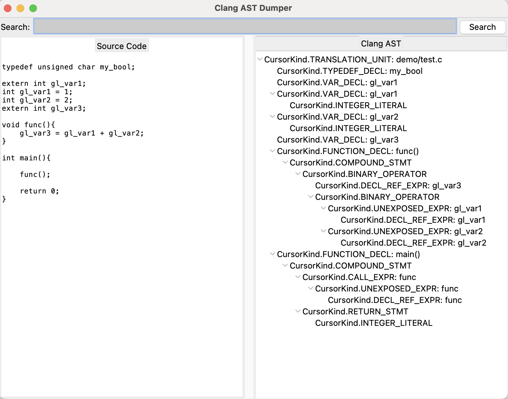
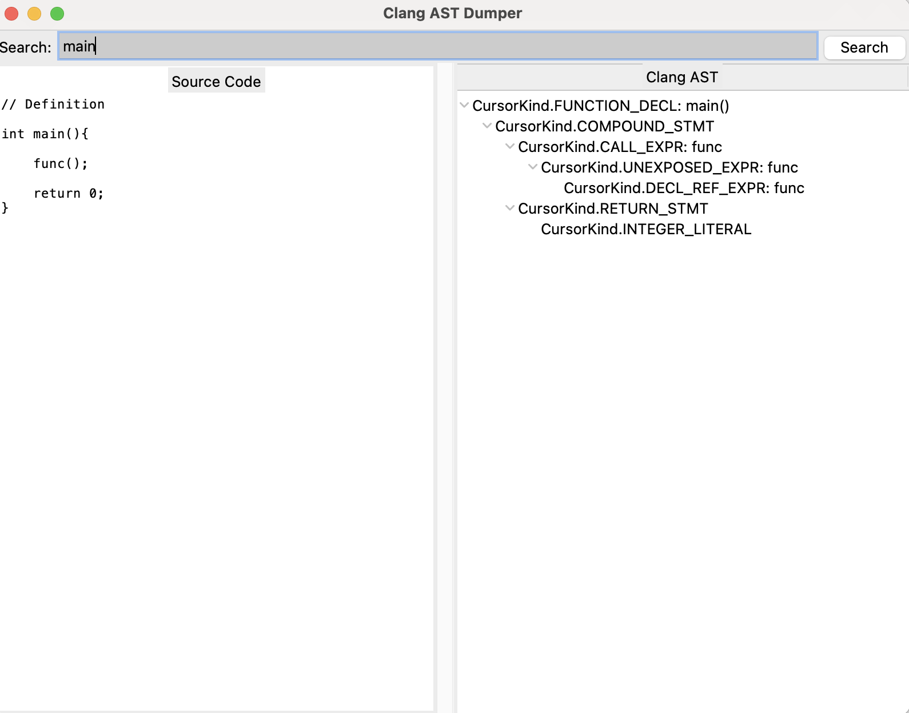

# Clang AST Dumper
A Python-based tool for visualizing and exploring the Abstract Syntax Tree (AST) of C source files using **Clang** and **Tkinter** for a graphical user interface (GUI):
- Displays the source code and its corresponding AST side by side.
- Search functionality to quickly locate symbols and their AST representations.
- Fully interactive GUI with expandable and collapsible AST nodes.
- Non-editable code view for clarity.

### Python Version
- Python 3.6 or higher

### Dependencies
- **Clang Python Bindings** (`libclang`)
- **Tkinter** (comes pre-installed with Python)

### Installation
Install Clang bindings:
```bash
pip install libclang
```

### Usage 
Run the script:
```bash
python clang_ast_dumper.py
```

### Explore the Clang AST
1. Load a file:
   - Insert the full path to a given input C file.
   - The source code will be read and parsed into an AST.
2. Search for a Symbol:
   - Type a symbol name in the search bar and press the Search button or hit Enter.
   - The AST and corresponding source code will update to reflect the selected symbol.
   - Leave the search bar empty and press Search to reset to the entire AST of the translation unit.
3. AST Interaction:
   - The AST tree is expandable and collapsible. Click on nodes to view child nodes.
4. View Code:
   - The code view updates automatically when a symbol is selected, displaying its declaration and/or definition.

### Examples:
1. Clang AST and source code of an entire translation unit:

2. Clang AST and source code of the main function:

